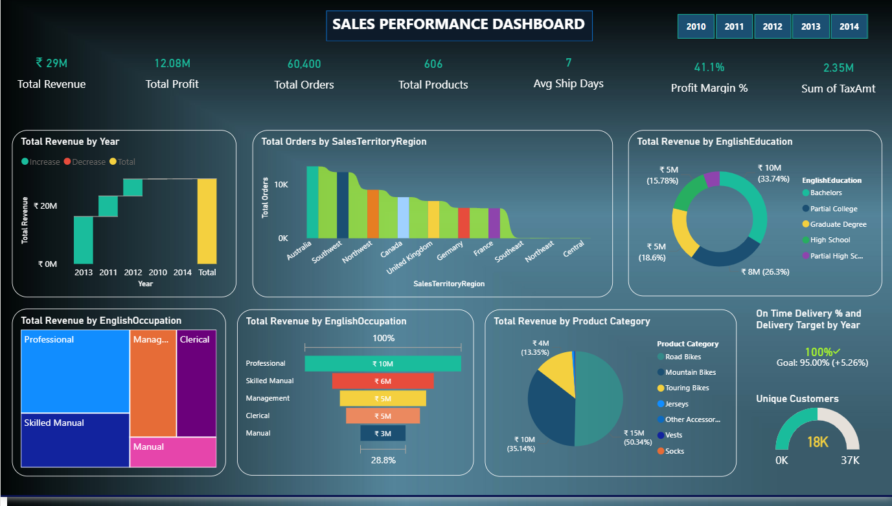

# Sales-Performance-Dashboard-
Power BI Sales Dashboard built using    │ Adventure Works data 2010-2014  
# 📊 Sales Performance Dashboard
### Power BI Business Intelligence Project



> **Built with:** Microsoft Power BI Desktop  
> **Data Source:** AdventureWorks Excel Dataset  
> **Period Covered:** 2010 – 2014  
> **Total Records:** 60,399 Sales Transactions  
> **Status:** ✅ Complete

---

## 🎯 Project Overview

This project is a complete end-to-end business intelligence solution built to answer 6 key business questions using the AdventureWorks sales dataset. Starting from raw Excel data with multiple quality issues, the project covers data cleaning, data modelling, DAX measure creation, and interactive dashboard design in Power BI.

---

## ❓ Business Questions Answered

| # | Question | Key Finding |
|---|---------|------------|
| 1️⃣ | **Building the Connections** — Connect data tables into a model | Star schema built with 4 tables and 5 relationships |
| 2️⃣ | **What drives our sales?** — Top vs lowest products and regions | Mountain Bikes (61%) + Australia (31%) drive all revenue |
| 3️⃣ | **Who are our customers?** — Segment by income, behaviour, education | Professional, Bachelor educated, $60K-$80K income in Australia |
| 4️⃣ | **Where are the delays?** — Shipping process and delivery times | 7-day avg, 100% on-time delivery, zero late orders |
| 5️⃣ | **Sales Performance** — Trends over time with drill-downs | 2013 peak at $16.4M = 55.7% of 4-year revenue |
| 6️⃣ | **Customer Behaviour** — Demographic insights and patterns | Professionals drive 34%, Bachelors drive 34% of revenue |

---

## 📈 Key Results

| Metric | Value | Insight |
|--------|-------|---------|
| 💰 Total Revenue | **$29.4 Million** | Across 2010–2014 |
| 💵 Total Profit | **$12.1 Million** | 41.1% margin |
| 📊 Profit Margin | **41.1%** | Above industry average of 20-30% |
| 📦 Total Orders | **60,399** | Across all regions |
| 👥 Unique Customers | **18,484** | Active buyers |
| 🚚 On-Time Delivery | **100%** | Zero late orders |
| ⏱️ Avg Ship Time | **7 Days** | Order to delivery |
| 🏆 Peak Year | **2013** | $16.4M — 55.7% of total revenue |

---

## 🗂️ Repository Structure
```
Sales-Performance-Dashboard/
│
├── 📊 Dashboard/
│   ├── Sales.pbix              — Main Power BI dashboard file
│   └── Dashboard.png           — Dashboard screenshot preview
│
├── 📄 Documentation/
│   ├── SalesPerformanceDashboard_Documentation.docx  — 32-page methodology doc
│   └── SalesPerformanceDashboard_Presentation.pptx  — 12-slide presentation
│
├── 📋 Data/
│   └── orders_data.xlsx        — Original raw AdventureWorks dataset
│
└── README.md                   — You are reading this now
```

---

## 🔧 How to Open the Dashboard

### Step 1 — Download Power BI Desktop
Download free from: [powerbi.microsoft.com](https://powerbi.microsoft.com/downloads/)

### Step 2 — Download the Dashboard File
Click on `Dashboard/Sales.pbix` above → Click **Download**

### Step 3 — Open and Explore
1. Double-click the downloaded `.pbix` file
2. Power BI Desktop opens automatically
3. Click **year buttons** [2010][2011][2012][2013][2014] to filter by year
4. Click **any chart** to cross-filter all other visuals
5. Click **blank area** to reset all filters

---

## 🏗️ How It Was Built

### Phase 1 — Data Cleaning (Power Query)
| Problem Found | Fix Applied |
|--------------|-------------|
| Dates stored as 8-digit numbers (20130415) | Converted to proper Date type using custom column formula |
| 6 null rows with missing sales data | Filtered out — reduced 60,405 to 60,399 clean rows |
| ProductKey stored as decimal/object type | Converted to integer for relationship join |
| No Product Category column existed | Created using DAX SWITCH + SEARCH formula |
| No Income Bracket column existed | Created income bands using DAX SWITCH formula |
| Income Bracket sorted alphabetically wrong | Created sort order helper column, applied Sort by Column |

### Phase 2 — Data Model (Star Schema)
```
              [DateTable]
                   │ 1:*
    [dim_Customer] │        [dim_Product]
         1 ────────┼──────── 1
                   * (fact_InternetSales) *
                   │──────── 1
                   │  [dim_SalesTeritory]
```

### Phase 3 — DAX Measures Created (17 Total)
| Category | Measures |
|----------|---------|
| Revenue | Total Revenue, Total Profit, Profit Margin %, % of Total Revenue |
| Orders | Total Orders, Orders Processed, Products Delivered |
| Customers | Unique Customers, Customers Served, Customer Count |
| Products | Products Sold, Category Rank |
| Shipping | Avg Delivery Time, Late Orders, On Time Orders, On Time Delivery %, Delivery Target |

---

## 💡 Key Insights

### What Drives Sales
- 🚴 **Mountain Bikes** drive **60.86%** of all revenue
- 🗺️ **Australia** is the top market at **31%** of global revenue
- 🔝 **Top 5 individual products** are ALL Mountain-200 variants
- 📉 **Accessories generate less than 1%** — massive opportunity missed

### Who Are Our Customers
- 👔 **Professionals** contribute **34%** of revenue
- 🎓 **Bachelor degree** holders contribute **34%** of revenue
- 💰 **$60K-$80K income** is the sweet spot
- 🌏 **94%** of all customers were acquired in **2013 alone**

### Operations
- ✅ **100% on-time delivery** — zero late orders across 60,399 transactions
- ⚡ **7-day average** ship time consistently maintained
- 📈 **2013 volume surge** of 15x handled without a single delay

---

## 🎯 Strategic Recommendations

| Priority | Recommendation | Opportunity |
|----------|---------------|-------------|
| 🔴 Critical | Launch accessories upsell program | $30M+ potential |
| 🔴 Critical | Never stockout Mountain-200 — top product | Revenue protection |
| 🟡 High | Assign sales reps to Southeast, Northeast, Central | $3M+ from zero-revenue territories |
| 🟡 High | Replicate Australia model in UK and Germany | $4M+ additional |
| 🟢 Medium | Reduce ship time from 7 to 3 days | Competitive advantage |
| 🟢 Medium | Build professional customer loyalty program | Increase repeat purchases |

---

## 📁 File Guide

| File | What It Contains | Who Should Open It |
|------|-----------------|-------------------|
| `Sales.pbix` | Interactive dashboard with year buttons and cross-filtering | Anyone with Power BI Desktop |
| `Dashboard.png` | Static screenshot of the dashboard | Anyone — no software needed |
| `SalesPerformanceDashboard_Presentation.pptx` | 12-slide project presentation | Anyone with PowerPoint or Google Slides |
| `SalesPerformanceDashboard_Documentation.docx` | Complete 32-page methodology document | Anyone with Word or Google Docs |
| `orders_data.xlsx` | Original raw AdventureWorks data | Anyone with Excel |

---

## 🛠️ Tools Used


---

## 📬 Contact

**Repository:** [github.com/pinjerlajyothika-alt/Sales-Performance-Dashboard-](https://github.com/pinjerlajyothika-alt/Sales-Performance-Dashboard-)

---

*Prepared for Management Review | Sales Performance Dashboard | AdventureWorks 2010–2014*
```

6. Scroll down
7. Commit message:
```
Upgrade README with complete project documentation and file guide
```
8. Click **"Commit changes"** ✅

---

## STEP 3 — Add Topics/Tags to Your Repository

Topics make your repository searchable and look professional.

1. Go to your repository main page
2. Look at the top right area — you will see **"About"** section
3. Click the **gear icon ⚙️** next to About
4. In the **"Topics"** box type these one by one pressing Enter after each:
```
power-bi
data-analytics
business-intelligence
dax
sales-dashboard
data-visualization
power-query
adventureworks
excel
data-cleaning
```

5. In the **"Website"** box you can leave blank
6. Click **"Save changes"** ✅

---

## STEP 4 — Add Description to Repository

1. Still in the **About** gear icon ⚙️ settings
2. In the **"Description"** box type:
```
📊 Complete Power BI Sales Dashboard — AdventureWorks data 2010-2014 | Data cleaning, Star Schema modelling, 17 DAX measures, Interactive dashboard with year-button filtering
```

3. Click **"Save changes"** ✅

---

## STEP 5 — Move Files Into Correct Folders

Since you already uploaded files to the root, you need to move them into the new folders. GitHub does not have a move button but here is how to do it:

### Move Sales.pbix to Dashboard folder

1. Click **Sales.pbix** in your repository
2. Click the **pencil icon** ✏️ to edit
3. At the top you will see the file path:
```
Sales-Performance-Dashboard- / Sales.pbix
```

4. Click on **Sales.pbix** in the path
5. Change it to:
```
Dashboard/Sales.pbix
```
6. Scroll down
7. Commit message:
```
Move Sales.pbix to Dashboard folder
```
8. Click **"Commit changes"** ✅

### Move Dashboard.png to Dashboard folder

1. Click **Dashboard.png**
2. Click pencil icon ✏️
3. Change filename path to:
```
Dashboard/Dashboard.png
```
4. Commit message:
```
Move Dashboard.png to Dashboard folder
```
5. Click **"Commit changes"** ✅

### Move Presentation to Documentation folder

1. Click **SalesPerformanceDashboard_Presentation.pptx**
2. Click pencil icon
3. Change path to:
```
Documentation/SalesPerformanceDashboard_Presentation.pptx
```
4. Commit message:
```
Move Presentation to Documentation folder
```
5. Click **"Commit changes"** ✅

---

## STEP 6 — Upload Missing Files

Check if you still need to upload:

1. Go to repository main page
2. Click **"Add file"** → **"Upload files"**
3. Upload any missing files:
```
If not already uploaded:
☐ orders_data.xlsx → upload to Data/ folder
☐ SalesPerformanceDashboard_Documentation.docx → upload to Documentation/ folder
```

For uploading directly to a folder:
1. Click on the **folder name** first
2. Then click **"Add file"** → **"Upload files"**
3. This automatically places files inside that folder

---

## STEP 7 — Write Good Commit Messages

Every time you make a change write a clear commit message. Good examples:
```
✅ GOOD commit messages:
"Add Dashboard folder with Power BI file and screenshot"
"Update README with complete project documentation"
"Fix Income Bracket sort order in dim_Customer"
"Add Data folder with raw Excel source file"
"Upload presentation slides for management review"

❌ BAD commit messages:
"Update"
"Changes"
"Fix"
"asdf"
"new file"
```

---

## STEP 8 — Final Repository Check

After all steps your repository should look like this:
```
pinjerlajyothika-alt/Sales-Performance-Dashboard-

📊 Power BI Sales Dashboard — AdventureWorks 2010-2014
Topics: power-bi  dax  data-analytics  sales-dashboard  excel

┌─────────────────────────────────────────────────────┐
│ 📁 Dashboard/                                       │
│    Sales.pbix — Main Power BI dashboard file        │
│    Dashboard.png — Screenshot preview               │
│                                                     │
│ 📁 Documentation/                                   │
│    SalesPerformanceDashboard_Documentation.docx     │
│    SalesPerformanceDashboard_Presentation.pptx      │
│                                                     │
│ 📁 Data/                                            │
│    orders_data.xlsx — Raw source data               │
│                                                     │
│ 📄 README.md — Complete project overview            │
└─────────────────────────────────────────────────────┘

README shows:
✅ Dashboard screenshot at top
✅ Business questions table
✅ Key results table
✅ Repository structure diagram
✅ How to open instructions
✅ Data cleaning table
✅ DAX measures list
✅ Key insights
✅ Recommendations table
✅ File guide table
✅ Technology badges
```

---

## ✅ COMPLETE CHECKLIST
```
Repository Setup:
☐ Description added to About section
☐ 10 topics/tags added
☐ README completely upgraded

Folders Created:
☐ Dashboard/ folder with README
☐ Documentation/ folder with README
☐ Data/ folder with README

Files Organized:
☐ Sales.pbix in Dashboard/
☐ Dashboard.png in Dashboard/
☐ Presentation.pptx in Documentation/
☐ Documentation.docx in Documentation/
☐ orders_data.xlsx in Data/

README Quality:
☐ Dashboard screenshot shows at top
☐ Business questions table
☐ Results table with emojis
☐ Repository structure diagram
☐ How to open guide
☐ DAX measures list
☐ Insights section
☐ Recommendations table
☐ File guide table
☐ Technology badges
